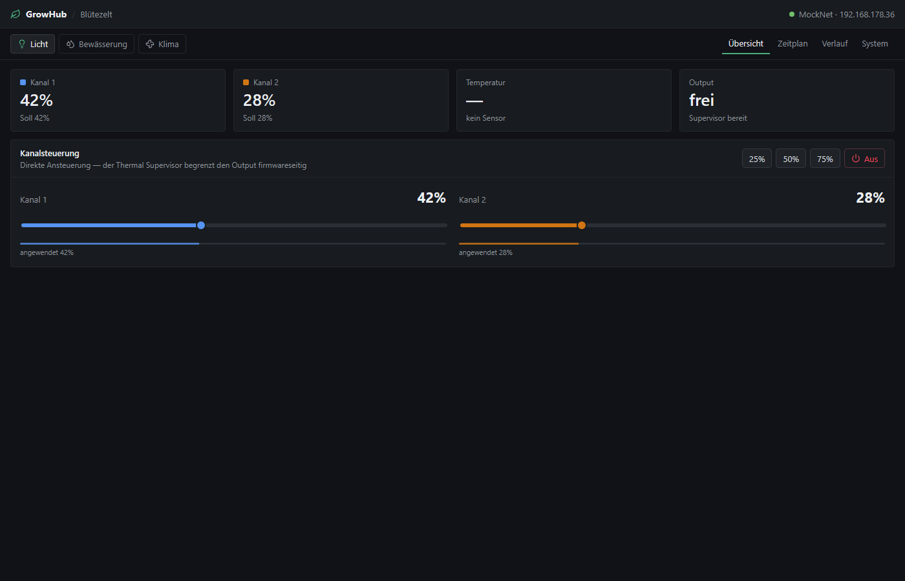
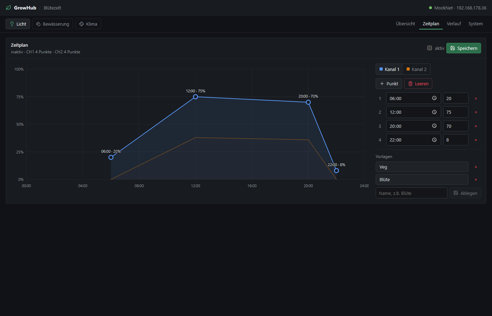
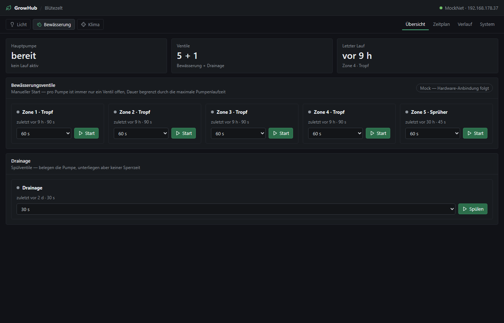
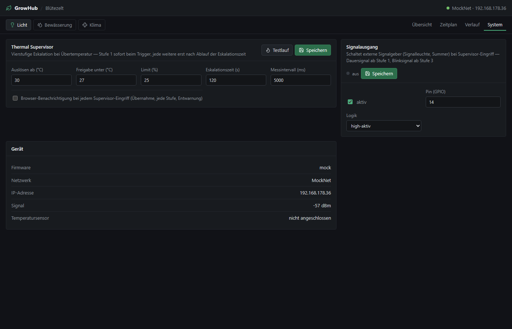
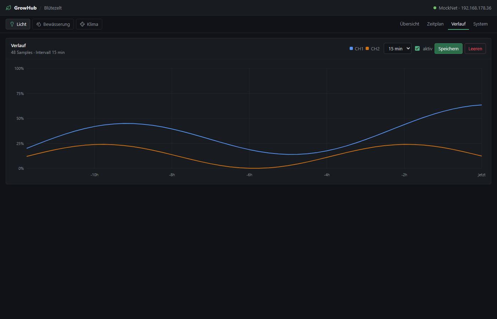

# GrowHub

**Local-first control console for ESP grow room controllers — lighting,
irrigation and climate as one system, driven over open, self-describing HTTP
contracts.**

[](https://github.com/Kurzschlusskind/GrowHub/actions/workflows/deploy.yml)
[](LICENSE)
[](spec/README.md)

**Live demo (mock mode, fully interactive):**
**https://kurzschlusskind.github.io/GrowHub/**

Without connected hardware every controller runs on a mock that implements
the exact same API contracts as real firmware — schedules fire, pumps queue,
the thermal supervisor escalates. The demo *is* the reference implementation.



## How it works

GrowHub runs wherever a browser reaches it — PC, home server, Raspberry Pi.
Controllers are plain HTTP endpoints on the local network; the app never runs
on them and they never depend on it:

```text
          Browser (you)
              │
              ▼
   ┌─────────────────────┐        GrowHub app (React SPA)
   │       GrowHub       │        · renders whatever devices report
   │  PC / Server / Pi   │        · polls state, sends idempotent commands
   └──────────┬──────────┘        · assumes nothing, reads everything back
              │  HTTP/JSON (spec/)
     ┌────────┼─────────────┐
     ▼        ▼             ▼
 ┌────────┐ ┌───────────┐ ┌─────────┐
 │Lighting│ │Irrigation │ │ Climate │   ESP32 controllers
 │ RS-485 │ │pumps+valve│ │(planned)│   · autonomous & fail-safe on their own
 └────────┘ └───────────┘ └─────────┘   · schedules and safety run on-device
```

Two principles carry the whole design:

1. **Devices describe themselves.** An irrigation controller announces its
   topology — pumps, valves, types — via `/api/irrigation/capabilities`. One
   pump with 6 valves or two pumps with 20: the app renders whatever is
   reported. Hardware layout is firmware configuration, never app code.
2. **Devices are autonomous.** Schedules execute on the controller. Every run
   has a hard firmware deadline. Boot state is always safe (all outputs off).
   The app is a stateless remote control — nice to have, never required.

## Features

**Lighting (RS-485)** — dual-channel dimming with desired-vs-applied
readback, a drag-and-drop daily curve editor, presets, and a sample log with
history chart.

**Irrigation** — topology-driven valve control with a shared-pump queue
(collisions execute sequentially, never drop), per-valve lockout that
protects roots from double watering (drain valves exempt), live schedule
execution, run history, and controller health (uptime, reset reason, heap,
clock validity).

**Thermal Supervisor** — a four-stage escalation chain against
over-temperature, entirely on-device: **1** reduce light PWM to the override
limit → **2** exhaust fan to 100 % → **3** drain the nutrient solution
(prevents root over-fertilization before flushing) → **4** flush roots with
fresh water through the irrigation circuit. Stage 1 fires immediately at the
trigger threshold; every further stage only after a configurable escalation
time without the temperature falling. A built-in **drill mode** plays the
whole chain against the live UI — including the irrigation pump actually
running the emergency flush. Optional browser notifications on every
transition, plus a configurable **signal output** (stack light / buzzer:
steady from stage 1, blinking from stage 3).

| | |
|---|---|
|  |  |
| Daily curve editor — drag points directly in the chart | Irrigation rendered from the announced topology |
|  |  |
| Supervisor config, drill trigger and signal output | Channel history from the device's sample ring buffer |

## Device API

Every controller implements a versioned, documented HTTP contract from
[`spec/`](spec/README.md) — a self-contained sub-project, licensed CC BY 4.0
so anyone can build compatible hardware (commercial included):

- [`spec/irrigation-controller.md`](spec/irrigation-controller.md) —
  capabilities model, pump/valve semantics, queueing, lockout, health,
  idempotent commands, robustness requirements (fail-safe boot, watchdog,
  atomic config, no-resume-after-reset)
- [`spec/lighting-controller.md`](spec/lighting-controller.md) — channels,
  daily curves, presets, thermal supervisor, drill, signal output

A device that implements a spec works with GrowHub out of the box:

```text
https://<growhub-host>/?irrigation=http://<device-ip>
https://<growhub-host>/?lighting=http://<device-ip>
```

No pairing, no cloud, no accounts. Deep links: `?device=irrigation`,
`?view=schedule`.

## Firmware

PlatformIO sub-projects under [`firmware/`](firmware/):

- [`firmware/irrigationcontroller/`](firmware/irrigationcontroller/) — ESP32
  implementation of the irrigation spec. The entire topology (pumps, valves,
  GPIO pins, active-low/high) lives in `data/topology.json`; the firmware
  announces it via `/capabilities`. Fail-safe boot, 10 s hardware watchdog,
  hard per-run deadlines, valve-before-pump switching order, NTP-gated
  schedules, atomic config persistence.
- [`firmware/lightingcontroller-rs485/`](firmware/lightingcontroller-rs485/)
  — ESP32 replacement controller driving grow lights over a
  reverse-engineered RS-485 frame protocol (interoperability notice in its
  LICENSE).

```text
pio run -t uploadfs && pio run -t upload
```

## Development

Requires Node.js >= 20.19.

```powershell
npm install
npm run dev      # http://localhost:5173, mock mode
npm test         # contract test suite
npm run build    # production build to dist/
```

### Testing

`npm test` runs a contract test suite (Node's built-in runner, zero extra
dependencies) against the mock — the reference implementation of both specs:
every endpoint, plus the behaviour rules (single pump per run, lockout,
runId idempotency, duration caps, self-ending runs, drill escalation and the
cross-device emergency flush). Time-dependent behaviour is tested by shifting
the clock. CI runs the suite before every deploy — a push that breaks a
contract never reaches the live demo.

### Deployment

Every push to `main` tests, builds and deploys to GitHub Pages
(`.github/workflows/deploy.yml`). The build uses a relative base path so it
works under the `/GrowHub/` sub-path on Pages as well as self-hosted.

## Roadmap

- Climate controller (spec + module; the catalog slot exists)
- Optional API token for write endpoints on shared networks; hardware-key
  (FIDO2) admin mode as the tamper-proof tier
- Config versioning (ETag) and verified-feedback capability flags — see the
  spec roadmaps

## License

- **App & firmware:** [PolyForm Strict 1.0.0](LICENSE) — noncommercial use
  permitted, including running it privately at home. No commercial use, no
  distribution, no derivative works. For anything beyond that, ask.
- **Device API specifications** (`spec/`): [CC BY 4.0](spec/LICENSE) — free
  to implement, including in commercial devices, with attribution.
